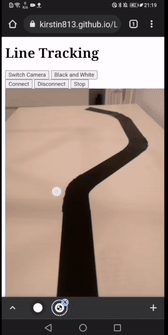

## Build Instructions

### Build steps - TODO
List the steps required to build software. 
Hopefully something simple like `pip install -e .` or `make` or `cd build; cmake ..`. In
some cases you may have much more involved setup required.
### Test steps - TODO
List steps needed to show your software works. This might be running a test suite, or just starting the program; but something that could be used to verify your code is working correctly.
Examples:
* Run automated tests by running `pytest`
* Start the software by running `bin/editor.exe` and opening the file `examples/example_01.bin`

#### Requirements
For the Web Bluetooth to work, your device needs Bluetooth 4.0-capable adaptor for it to work correctly. Almost all new computers/devices come with this, if not then you will need an external Bluetooth LE dongle if your computer or device:
* Is an Apple Mac made before 2012
* Is a Windows PC with a Windows version before 10
* Is a Desktop PC - it may not have any wireless support at all
* Is running Linux - it does work to an extent but would be better if an external USB adaptors was used

For more information on if your device is compatible with Web Bluetooth visit: https://www.espruino.com/Quick+Start+BLE

Note: If you are using iOS, Web Bluetooth only works when you have downloaded [this app](https://apps.apple.com/us/app/webble/id1193531073). Furthermore, for this project, the app will only work for the simple controller as it does not support `getUserMedia`.

This project has been development using Javascript and Visual Studio Code.

## Instructions for use

#### Connecting to Robot 

Once everything is set up, make sure that Bluetooth is enabled on both your device and the robot itself. The connection can be made by clicking on the `connect` button on the webpage. The `connect` is at the same place on every webpage. When the pop displays, you next want to choose `Web Bluetooth` which will then display all enabled Bluetooth devices nearby. Finally, click on the name of the robots Bluetooth and that is you connected. 

    

    
To disconnect from the robot, simply click on the `disconnect` button.

#### Object Tracking 

To work with object tracking visit [here](https://kirstin813.github.io/L4-Individual-Project/src/objectTracking/). To connect to the robot check out the above subsection or alternatively follow this [link](https://github.com/Kirstin813/L4-Individual-Project/tree/main/src#connecting-to-robot). 

Now that we have connected to the robot, place your smartphone on the mount of the robot and switch the camera orientation to access the back facing camera. To do this, simple click on the `Switch Camera` and  we can now begin with our colour tracking. Choose an object with an idenfiying colour. **Make sure that the colour of the object does not match with the colour of the background on your video**. We find that colours such as red, blue, green and yellow work best. 

Once you have found an object, position the object in front of the smartphoone so that it is visible from the displayed video. For the colour tracking to begin, click on the object displayed on the video feed and a small colour tracking circle should pop up as below. 

    

Once the object colour has been identified, the robot will begin to move forward as long as you have the object placed in the middle of the video. To allow the robot to move left or right, position the object accordingly in either the left or right sections of the video as seen below. 

    

Congratulations, you're robot is now following a coloured object. To stop the robot from tracking the object and stop moving, remove the visiblity of the object from the video feed and then disconnect from the robot. 

To watch a demo of this stage in action check out: https://youtu.be/LbqPyVP_ZSk

#### Follow a Face

To work with the face tracking stage of this project click [here](https://kirstin813.github.io/L4-Individual-Project/src/followFace/).

For this stages development, it utilises and expands [MediaPipe Solutions](https://google.github.io/mediapipe/solutions/solutions.html) using its [Face Detection](https://google.github.io/mediapipe/solutions/face_detection#javascript-solution-api) framework for Javascript. Again, connect to the robot using the same instructions as [above](https://github.com/Kirstin813/L4-Individual-Project/tree/main/src#connecting-to-robot). 

Place the smartphone on the mount on the robot and keep the video orientation as it is, using the front facing camera. Once a connection has been made, a bounding box surrounding your face will appear along with red dots for your facial landmarks i.e. nose, eyes, ears, etc. 

    

In this instance, the robot will not move forward if your face is in the centre of the video feed. Instead, it will move left or right depending which way you move around. I would suggest you try placing the robot on a table and start walking around the table and the robot will follow your face as you move about. 

Congratulations, the robot is now following your face! To stop and disconnect the robot, position you face in the centre to stop the robot moving and then click on the `disconnect` button. 

To watch a demo of this stage in action check out: https://youtu.be/tcuBm0bdRoQ

#### Follow a Black Line 

To work with line tracking stage of this project click [here](https://kirstin813.github.io/L4-Individual-Project/src/lineTracking/). Again, connect to the robot using the instructions [here](https://github.com/Kirstin813/L4-Individual-Project/tree/main/src#connecting-to-robot).

Once again, place the smartphone onto the mount, switch the camera orientation by clicking on `Switch Camera` to access the back facing camera and then to display the video click on `Open Camera`. As for the position of the smartphone, try to angle it downwards as much as possible so that only the circuit is visible to the video feed.

For this stage, you will need to create your object black circuit line as pictured below. 

    

You can create the circuit by either using black tape or black paint. However, black tape is suggested more. You can shape the circuit however you like but **make sure the line is thick enough for the camera to see and that it has no harsh 90 degree angles as it will not turn properly otherwise**. To ensure that the line is thick enough, place the robot on the circuit and line it up with the middle 'sensor' as shown below.

    

If the line does not fill up the majority of the 'sensor' outlined in the white bounding box then it may not work as well so adjusting the line size accordingly. 

Once you have adjusted the line size and positioned the robot on the starting point of the line, it will begin to follow the black line. It will move forward if the middle sensor detects the colour black, move left if the left sensor detects the colour black, and move right if the right sensor detects the colour black. 

Congratulations, the robot can now follow a black circuit line! This would be good to interact with friends and see how long it takes for their robot to complete a round of the circuit!

To stop and disconnect the robot, simply click on the `Stop` button and then the `Disconnect` button.

To watch a demo of this stage in action check out: https://youtu.be/gU-inQBeqLM

### Self Driving 

*Description of code*

